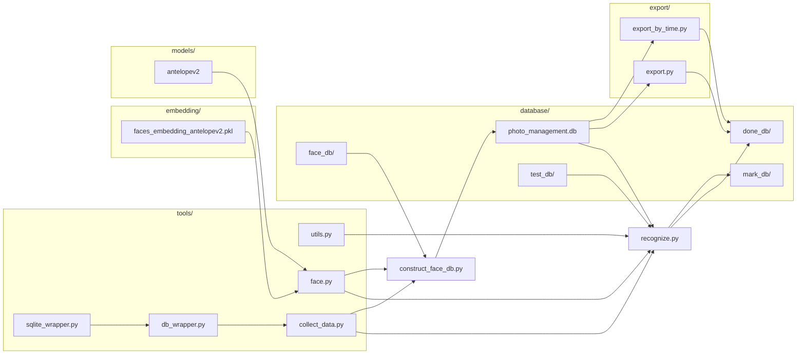
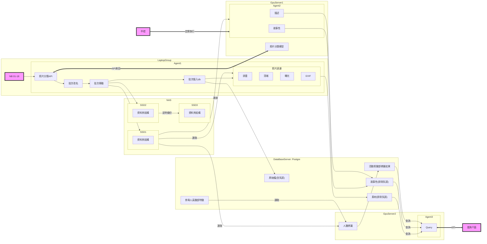

## Docker部署手順

1. 調整numpy未支援np.int
vim /usr/local/lib/python3.12/site-packages/insightface/app/face_analysis.py
`:%s/np.int/np.int64/g`

2. 手動下載臉部辨識模型
下載：https://drive.google.com/file/d/1yp7LnOeIPa_NAh1D4TFsxNngCiZsCCEA/view?usp=sharing

移至：/root/noob/service/models

解壓縮：

```python
cd /root/noob/service/models/ 
tar zxvf antelopev2.tar.gz 
```

(v2.0 可略過)
下載：https://drive.google.com/file/d/1TIRlJKbWsfyks3XBq0R8M2dUf8UPpQnB/view?usp=sharing

移至：/root/noob/service/embedding

解壓縮：

```python
cd /root/noob/service/embedding
tar zxvf faces_embedding_antelopev2.tar.gz
```

(v2.0 可略過)
下載：https://drive.google.com/file/d/1Wrq4EwpMVLxwLRbOeurTvohHffSqTgwA/view?usp=sharing

移至：/root/noob/database

解壓縮：

```python
cd /root/noob/database
tar zxvf photo_management.tar.gz
```

3. 啟用所有container 調整 細部設定
docker compose 啟用
docker network list 查詢 custom_network 的 network_id
docker network inspect <network_id> 查詢 db container IP
修改 share/config.py 變數 MYSQL_HOST = <db container IP>
docker compose restart 重啟所有 container 

# 臉部辨識

## new_insert_feature_src.py

### Note: 完成

### 目的

- 彙整指定資料夾: feature_src 內所有照片路徑與檔名。檔名：資管_113_09_張景裕、老師_999_99_黃世禎
- 依照檔名 取出相關資料 
- 將資料存至 DB: mydatabase Table: base。欄位: 部門[系,老師], 級別, 小組, 中文名, phash, 特徵來源照片資料夾, 特徵來源照片檔名
columns=['Dept', 'year', 'team', 'name', 'phash', 'file_path', 'file_name']


## new_construct_face_db.py

### Note: 完成

### 目的

- 根據 DB: mydatabase Table: base 取得人員資料。 欄位: 部門[系,老師], 級別, 小組, 中文名, phash, 特徵來源照片資料夾, 特徵來源照片檔名
columns=['Dept', 'year', 'team', 'name', 'phash', 'file_path', 'file_name']
- 取得臉部特徵
- 將 特徵 存至 faces_embedding_antelopev2_114.pkl, 欄位: user_name(113_09_資管_張景裕_英文名、999_99_老師_黃世禎_英文名), feature 512維


## new_recognize.py (API常駐)

### Note: 接近完成。
- 差壓測 與 load balance 調教
- 缺解析照片名稱的部分

### 目的
- 其他電腦的程式 API request: 彙整指定資料夾: <活動資料夾路徑> 內所有照片路徑與檔名。檔名格式: 活動日期_攝影師_拍攝年月日時分秒毫秒_活動名稱_組別
範例：20250613_吳峰期_20250613100503123_校園巡禮_09
- 調整為API觸發，辨識照片中的人臉屬於是誰
- 完成辨識後將結果存至 DB: mydatabase Table: reco_result。 欄位: 照片路徑, 照片檔名, 活動日期, 攝影師, 拍攝年月日時分秒毫秒, 活動名稱, 組別, 照片成員(JSON格式)


# 以下為舊版
## recognize.py (常駐)

### Note: 已測試，正常運作

### 目的

- 每秒監控 指定資料夾：FACE_TEST_PATH
- 辨識照片中的人臉屬於是誰
- 完成辨識後將照片移動至資料夾：FACE_DONE_PATH 並重新命名

## construct_face_db.py

### Note: 已測試，正常運作

### 目的

- 取得臉部特徵
- 根據圖片名稱格式(112_01_企管_陳雅琳) 取得人員資料, 存至 DB: photo_management.db, 欄位: 名稱, 小組, 部門[系,老師], 級別
- 將 特徵 存至 faces_embedding_antelopev2.pkl, 欄位: user_name(112_01_企管_陳雅琳), feature 512維

## export_by_time.py

### Note: 未修正，評估後續用不到

### 目的

- 依照執行系統找到對應捷徑資料夾儲存位置
- 依照開始時間及結束時間，從DB: photo_management.db 取出資料
- 建立所有照片捷徑至捷徑資料夾

## export.py

### Note: 未修正，評估後續用不到

### 目的

- 依照執行系統找到對應捷徑資料夾儲存位置
- 依照參數給定的sql, 從DB: photo_management.db 取出資料
- 建立所有照片捷徑至捷徑資料夾


## v1.0 程式架構


# 預期 v2.0 系統架構



# windows佈署手順 (Plan B)

## 安裝

1. 安裝miniconda3
2. 開啟cmd
3. 執行 conda init 啟用miniconda
4. 執行 conda create -y python=3.12 --name noob 接著輸入很多Y
5. 執行 conda activate noob
6. cd到指定資料夾，準備執行 git clone https://github.com/Eric76ch/noob.git
7. cd到 noob 資料夾內的infrastructure
8. pip install -r requirements.txt
9. 理論上就完成了

## 手動下載臉部辨識模型
下載：https://drive.google.com/file/d/1yp7LnOeIPa_NAh1D4TFsxNngCiZsCCEA/view?usp=sharing
移至：../service/models
解壓縮：antelopev2.tar.gz 


下載：https://drive.google.com/file/d/1TIRlJKbWsfyks3XBq0R8M2dUf8UPpQnB/view?usp=sharing
移至：../service/embedding
解壓縮：faces_embedding_antelopev2.tar.gz


下載：https://drive.google.com/file/d/1Wrq4EwpMVLxwLRbOeurTvohHffSqTgwA/view?usp=sharing
移至：../database
解壓縮：photo_management.tar.gz


## 環境設定
1. 開啟noob虛擬環境中的cmd 
2. set CONFIG_PATH=C:\Users\<user-name>\<this-is-a-folder>\noob\shared\win
3. 開啟資料夾 C:\Users\<user-name>\AppData\Local\miniconda3\envs\noob\Lib\site-packages\insightface\app\
4. 打開 資料夾中 face_analysis.py 找到 np.int 取代 為 np.int64，共3處
## 2026-04-22 修正紀錄

本次已完成並驗證的修正如下：

### 1. Docker 與啟動修正
- `shared/config.py` 的 MySQL host 已調整為 `db`，讓 API 容器透過 Docker network 直接連線 MySQL。
- `infrastructure/Dockerfile` 已將過時的 `libgl1-mesa-glx` 改為 `libgl1`，避免 image build 失敗。
- `infrastructure/start.sh` 已補上較長的 Gunicorn timeout，避免 `/image_socre` 首次下載模型時 worker 提前 timeout。

### 2. `/image_socre` 修正
- `service/new_recognize.py` 已改為 lazy load `clipiqa+`，避免一啟動 API 就卡在模型初始化，導致 `/docs` 和 `/openapi.json` 無法正常開啟。

### 3. `label_face_name=true` 標記圖修正
- 已建立 `database/mark_db/` 目錄，並確認容器與本機目錄同步正常。
- `service/new_recognize.py` 已補上：
  - 存圖前自動建立輸出目錄
  - 使用 `os.path.join(...)` 組標記圖路徑
  - 寫入「開始存圖 / 存圖成功」日誌
  - `cv2.imencode(...)` 失敗時拋出明確錯誤

### 4. NumPy / InsightFace 相容性修正
- `service/tools/new_face.py` 已補上 `np.int` 相容處理，解決標記圖階段因 `module 'numpy' has no attribute 'int'` 導致流程中斷的問題。
- 這個錯誤會出現在有偵測到臉、甚至已辨識成功之後，因此外部只看到 API 回 `202`，但 `mark_db` 沒有輸出圖。

## 已驗證結果

以下流程已實際驗證成功：
- `POST /async-recognize/` 回應 `202`
- 背景辨識成功
- 成功辨識姓名
- 成功輸出 `*_mark.jpg`
- 成功寫入 MySQL `reco_result`

驗證案例：
- 測試圖片：`/mnt/activity/企管_114_2_吳偉青.JPG`
- 成功輸出：`/root/noob/database/mark_db/企管_114_2_吳偉青_mark.jpg`
- `reco_result` 已寫入：
  - `reco_count = 1`
  - `reco_unknow = 0`
  - `reco_name = ["企管_114_2_吳偉青"]`

## 如果 `label_face_name=true` 還是沒有輸出圖

請依序檢查：
- `file_path` 是否為容器內可讀的路徑，例如 `/mnt/activity/xxx.jpg`
- 該圖片是否真的有偵測到人臉
- `database/mark_db/` 是否存在
- `/var/log/activity_photo_reco.log` 是否出現 `start saving marked face image` 與 `marked face image saved`
- `/var/log/fastapi.log` 是否真的帶到 `label_face_name=true`
